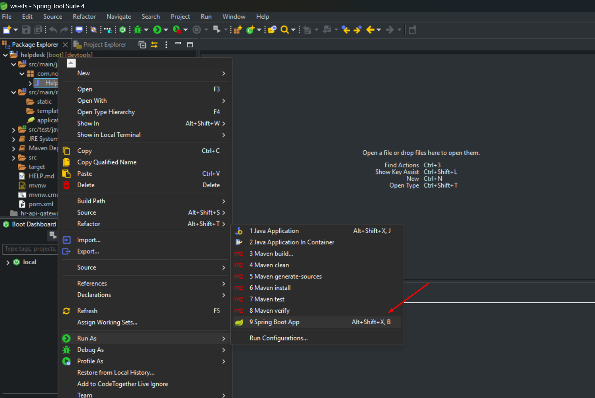

# 🛠 Helpdesk API


API REST desenvolvida com **Spring Boot** para gerenciamento de chamados de suporte técnico.

---

## 🚀 Tecnologias

- Java
- Spring Boot
- Spring Data JPA
- Spring Security
- MySQL
- H2 Database
- Maven

---

## ▶️ Como executar o projeto

### Pelo Spring Tool Suite (STS)

1. Abra a classe:

```
HelpdeskApplication.java
```

2. Clique com botão direito

```
Run As → Spring Boot App
```

Aplicação iniciará em:

```
http://localhost:8080
```


---

### Pelo terminal

```
mvn spring-boot:run
```

---

## 🧪 Banco H2

Console disponível em:

```
http://localhost:8080/h2-console
```

---

## 👨‍💻 Autor

José Nobre