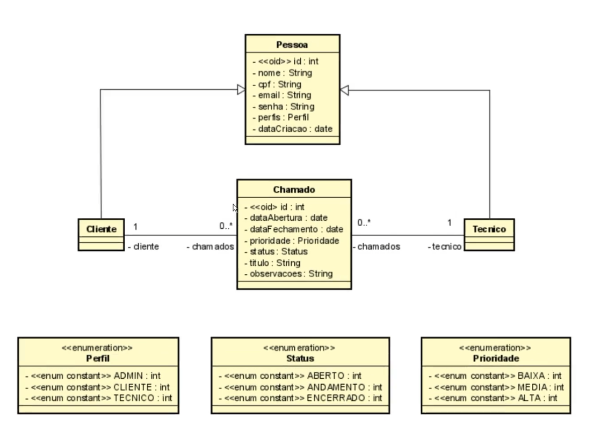

# 🛠 Helpdesk API


API REST desenvolvida com **Java + Spring Boot**, com foco em **arquitetura em camadas e segurança de aplicações**, utilizando autenticação baseada em **JWT (JSON Web Token)**.

O sistema simula um ambiente real de suporte técnico, permitindo o gerenciamento de **clientes, técnicos e chamados**, com controle de acesso e proteção de endpoints.

---

# 🚀 Funcionalidades

- Cadastro e gerenciamento de clientes
- Cadastro de técnicos
- Abertura e acompanhamento de chamados
- Controle de status e prioridade
- Autenticação e autorização com JWT
- Proteção de endpoints com Spring Security

---

# 🔐 Segurança (JWT)

A aplicação implementa autenticação **stateless**, sem uso de sessão no servidor.

## Fluxo de autenticação


1. Usuário realiza login com email e senha  
2. API gera um token JWT assinado (HS512)  
3. O cliente envia o token no header (`Authorization: Bearer`)  
4. O backend valida o token a cada requisição  
5. Acesso é liberado conforme permissões  

## Implementação técnica

- Spring Security configurado como stateless  
- Filtro customizado de autenticação (`JWTAuthenticationFilter`)  
- Geração de token com expiração configurável  
- Integração com `UserDetailsService`  
- Controle de acesso baseado em perfis (roles)  

---

# 🛠 Tecnologias

- Java 11  
- Spring Boot  
- Spring Security  
- JWT  
- Spring Data JPA  
- Maven  
- MySQL  
- H2 Database  

---

# 🏗 Arquitetura

A aplicação segue o padrão em camadas:

```text
Controller → Service → Repository → Database
```

Separação de responsabilidades:

- **Controller** → endpoints REST  
- **Service** → regras de negócio  
- **Repository** → acesso a dados  
- **Security** → autenticação e autorização  

---

# 🔄 Fluxo da API

```text
Cliente (Postman)
       ↓
Controller
       ↓
Service
       ↓
Repository
       ↓
Database

+ Segurança (Spring Security + JWT Filter)
```

---

# 🧠 Modelo de Domínio

Entidades principais:

- Pessoa  
- Cliente  
- Tecnico  
- Chamado  

Enums:

- Perfil  
- Status  
- Prioridade  

## Diagrama do Modelo Conceitual



📚 Documentação detalhada:
- [Modelo de Domínio](docs/modelo-dominio.md)

---

# 📡 Endpoints da API

| Método | Endpoint | Descrição |
|------|------|------|
| GET | `/clientes` | Lista todos os clientes |
| GET | `/clientes/{id}` | Busca cliente por ID |
| POST | `/clientes` | Cria um novo cliente |
| PUT | `/clientes/{id}` | Atualiza um cliente |
| DELETE | `/clientes/{id}` | Remove um cliente |
| GET | `/tecnicos` | Lista todos os técnicos |
| GET | `/tecnicos/{id}` | Busca técnico por ID |
| POST | `/tecnicos` | Cria um novo técnico |
| PUT | `/tecnicos/{id}` | Atualiza um técnico |
| DELETE | `/tecnicos/{id}` | Remove um técnico |
| GET | `/chamados` | Lista todos os chamados |
| GET | `/chamados/{id}` | Busca chamado por ID |
| POST | `/chamados` | Cria um chamado |
| PUT | `/chamados/{id}` | Atualiza um chamado |
| DELETE | `/chamados/{id}` | Remove um chamado |

---

# 📂 Estrutura do Projeto

```text
src/main/java/com.nobre.helpdesk

controller
service
repository
domain
 ├ Pessoa
 ├ Cliente
 ├ Tecnico
 ├ Chamado
 └ enums
     ├ Perfil
     ├ Status
     └ Prioridade
```

---

# ▶️ Como executar o projeto

## Pelo Spring Tool Suite (STS)

Abra a classe principal:

```
HelpdeskApplication.java
```

Execute:

```
Run As → Spring Boot App
```

A aplicação iniciará em:

```
http://localhost:8080
```


---

## Pelo terminal

Dentro da pasta do projeto execute:

```bash
mvn spring-boot:run
```

---

# 🧪 Banco H2

Console disponível em:

```
http://localhost:8080/h2-console
```

---

# 📚 Documentação

Documentação detalhada disponível na pasta **docs**:

- [Arquitetura](docs/arquitetura.md)
- [Modelo de Domínio](docs/modelo-dominio.md)
- [Banco de Dados](docs/banco-de-dados.md)
- [Autenticação JWT](docs/autenticacao-jwt.md)
- [Fluxo da API](docs/fluxo-api.md)

---

# 🚀 Próximos passos

- Implementação de filtro de autorização (validação do token por requisição)  
- Refatoração da camada de segurança  
- Melhor tratamento global de exceções  
- Evolução das regras de negócio  

---

# 👨‍💻 Autor

José Nobre  

🔗 [GitHub:](https://github.com/jnobr3c ) jnobr3c

🔗 [LinkedIn:](https://www.linkedin.com/in/jos%C3%A9-nobrec/) José Nobre
